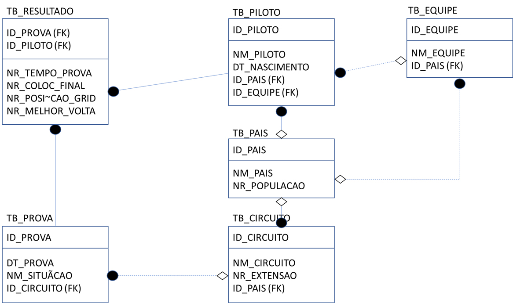

# Projeto Integrador: ETL de Dados de Fórmula 1

## 📄 Resumo do Projeto

Este projeto consiste na construção de um processo completo de **ETL (Extração, Transformação e Carga)** para popular um banco de dados relacional com informações históricas sobre o campeonato mundial de Fórmula 1. A partir de diversas fontes de dados brutas e heterogêneas, foi realizado um tratamento robusto para garantir a qualidade, consistência e integridade dos dados, preparando-os para futuras análises.

## 📁 Schema do Banco de Dados

O banco de dados, nomeado `worldrace`, foi modelado para conter as principais entidades do universo da F1, como pilotos, equipes, circuitos e resultados, garantindo a integridade relacional através de chaves primárias e estrangeiras.

**Diagrama Entidade-Relacionamento (DER):**

## 📚 Fontes de Dados (Extração)

Para a construção da base, foram utilizadas três fontes de dados públicas:

1.  **Kaggle - F1 World Championship (1950-2020):** Fonte principal contendo a maior parte dos dados brutos sobre pilotos, equipes, circuitos, corridas e resultados.
    * **Link:** `https://www.kaggle.com/datasets/rohanrao/formula-1-world-championship-1950-2020`

2.  **Kaggle - World Population:** Fonte utilizada para os dados demográficos e para criar uma "fonte da verdade" para a padronização dos nomes dos países.
    * **Link:** `https://www.kaggle.com/datasets/samithsachidanandan/world-population-by-countries-2025`

3.  **Wikipedia - List of F1 Circuits:** Fonte complementar para o enriquecimento dos dados de circuitos com a informação de extensão da pista (`nr_extensao`).
    * **Link:** `https://en.wikipedia.org/wiki/List_of_Formula_One_circuits`

## 🛠️ Ferramentas e Tecnologias

* **Linguagem & Bibliotecas:** Python 3, Pandas
* **Ambiente de Desenvolvimento:** Jupyter Notebook no VS Code
* **Banco de Dados:** MySQL
* **Controle de Versão:** Git e GitHub

## ⚙️ Processo de ETL (Transformação e Carga)

A fase de transformação foi a mais complexa, realizada inteiramente em Python. O objetivo foi limpar e estruturar os dados para que estivessem perfeitamente alinhados com o schema relacional.

### Transformação
* **Padronização de Dados:** Foi criada uma "fonte da verdade" para os países (`tb_Pais`). A partir dela, foram criados dicionários de mapeamento para corrigir inconsistências em todos os outros arquivos (ex: "USA" -> "United States"; "British" -> "United Kingdom").
* **Enriquecimento de Dados:** O dataset de circuitos foi enriquecido com a informação de extensão da pista, obtida através do merge com os dados da Wikipedia.
* **Criação de Chaves Estrangeiras:** O passo mais crítico foi a substituição de dados textuais (como nomes de países e equipes) pelos seus IDs numéricos correspondentes. O fluxo foi:
    1.  Carregar uma tabela "pai" (ex: `tb_pais`) no banco de dados para que os IDs fossem gerados via `AUTO_INCREMENT`.
    2.  Exportar essa tabela de volta para um arquivo CSV, agora contendo os IDs oficiais.
    3.  Usar esse arquivo como um "gabarito" para mapear e criar as colunas de chave estrangeira nas tabelas "filhas" (ex: `tb_circuito`).
* **Tratamento de Dados Complexos:** Regras de negócio foram aplicadas para tratar casos específicos, como a conversão de resultados textuais (ex: "R" de "Retirado") para valores numéricos (`0`) na tabela de resultados, e o uso da coluna `milliseconds` para garantir a precisão dos tempos de prova.

### Carga
Após a geração de arquivos `.csv` finais e limpos para cada tabela, a carga no MySQL foi realizada através de scripts SQL gerados via Python. Foi utilizada uma estratégia de carga segura:
1.  Desabilitar temporariamente a verificação de chaves estrangeiras (`SET foreign_key_checks = 0`).
2.  Limpar a tabela de destino (`TRUNCATE TABLE`).
3.  Executar os comandos `INSERT` para todos os registros.
4.  Reabilitar a verificação de chaves estrangeiras (`SET foreign_key_checks = 1`).

## 🏁 Resultado Final

O projeto resultou em um banco de dados MySQL, `worldrace`, totalmente populado com dados históricos da F1. A base de dados é limpa, consistente e possui integridade relacional garantida, estando pronta para ser utilizada em projetos de consulta, análise de dados e Business Intelligence.